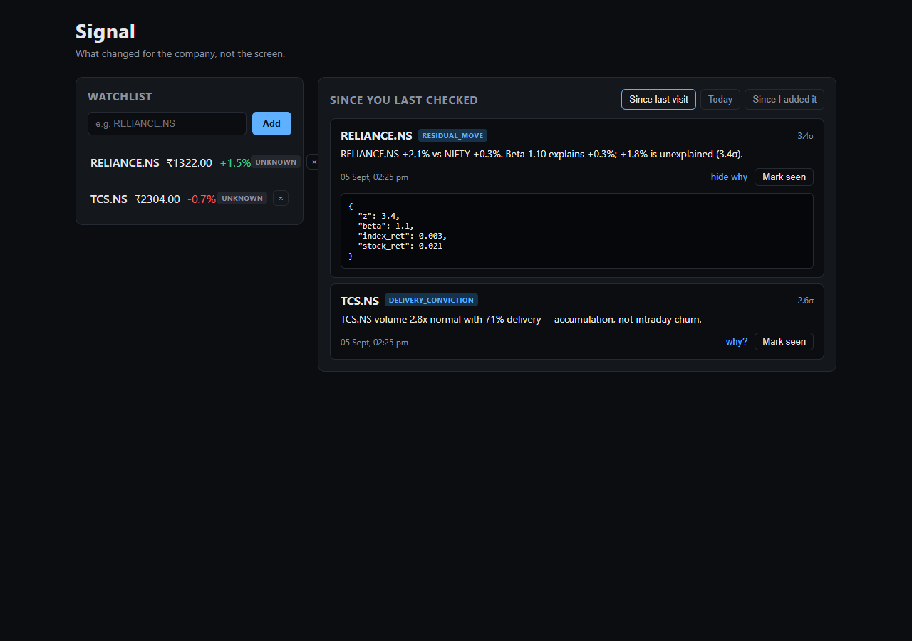

# Signal

**Groww CODE 2026 — Smart Market Watchlist**

A watchlist should tell you what changed *for the company*, not what changed on the screen. Signal strips out index-driven co-movement and alerts only on the unexplained residual — so on a day the whole market drops 2%, a stock that dropped 2% alongside it stays quiet, and the one that broke rank gets flagged.



## 100-word pitch

Most watchlists tell you a stock moved. They can't tell you whether it mattered. Signal fits each stock's beta against NIFTY from daily closes, and alerts only on the residual — the move beta *can't* explain — scored against that stock's own historical residual volatility, not one fixed threshold for every name. Every alert carries a plain-English reason and the raw evidence behind it, never just a number. The ack watermark is monotonic per symbol, so a slow request from a second device can never rewind what you've already seen, and staleness is shown honestly — a 40-minute-old price never poses as live.

## What's built so far

This submission is at PLAN.md's step-7 checkpoint. Working end to end, against a real Postgres database and real Yahoo Finance data:

- **`backend/app/sources.py`** — Yahoo daily history + intraday quotes. `as_of` always comes from the source's own timestamp, never the server's clock; requests carry a browser `User-Agent` and retry with backoff (Yahoo 429s the default one).
- **`backend/app/detector.py`** — fits beta per symbol from daily closes, scores new returns as a residual z-score, emits an event only past `|z| >= 2.0`. Self-tested on two hand-constructed symbols with a known-quiet day and a known 6%-unexplained-jump day.
- **`backend/app/db.py` / `models.py`** — `events` table with fingerprint-based dedup (`ON CONFLICT DO NOTHING`), so a detector re-scoring the same tick never double-alerts.
- **`backend/app/main.py`** — `GET/POST/DELETE /api/watchlist`, `GET /api/feed?lens=since_last|today|since_added`, `POST /api/ack`. Users are identified by an opaque cookie (no real auth — see Scope below).
- **`frontend/`** — a one-page Vite/React app: watchlist (price, % change, staleness badge) on the left, an event inbox (lens switcher, reason text, a "why?" expander showing the raw evidence JSON, an explicit per-symbol "Mark seen" action) on the right. Polls every 15s, no WebSockets.

## Setup (clean clone, Postgres already provisioned)

```bash
git clone https://github.com/RitzRaven19/signal.git && cd signal
python -m venv .venv && source .venv/bin/activate   # Windows: .venv\Scripts\activate
pip install -r backend/requirements.txt
cp backend/.env.example backend/.env   # fill in DATABASE_URL
cd frontend && npm install && npm run build && cd ../backend
uvicorn app.main:app --reload
```

Open `http://127.0.0.1:8000`. `backend/.env.example` documents the one variable this needs (`DATABASE_URL`); nothing else is required to run it locally.

## The residual formula, and why it's the definition of "meaningful"

```python
rs = diff(log(stock_closes))          # daily stock log-returns
ri = diff(log(index_closes))          # daily NIFTY log-returns
beta = cov(rs, ri) / var(ri)
residual = stock_ret - beta * index_ret
z = residual / resid_sigma            # resid_sigma: trailing 20d stdev of residual
```

A stock's daily return is decomposed into the part beta says the index explains (`beta * index_ret`) and whatever is left over (`residual`). That leftover is specific to the company, not to the market — it's the part a beta-crash or a sector rally can't take credit for. Z-scoring the residual against *that stock's own* historical residual volatility, rather than a single fixed percentage move for every stock, is what makes the threshold meaningful: a 2% move is unremarkable for a stock whose residual normally swings 2%, and a 4σ event for one whose residual is usually near zero. An event only fires past `|z| >= 2.0`, and every event carries the full arithmetic behind it in `evidence`, not just the final number.

## Watermark semantics

`ack.acked_at` only ever moves forward: `POST /api/ack` upserts with `set acked_at = GREATEST(ack.acked_at, excluded.acked_at)`. A slow request from a second device (an ack in flight from a phone, say, racing a newer ack from a laptop) can never rewind what the user has already marked seen — the greater of the two timestamps always wins, server-side. Verified directly: acking with a deliberately-older timestamp after a newer ack leaves `acked_at` unchanged.

## Edge cases handled so far (each with its one-line mitigation)

- **Yahoo blocks the default HTTP client with 429s** → every request sends a browser `User-Agent` and retries up to 3 times with linear backoff.
- **A live price can quietly go stale** → every quote carries a `staleness` tier (`live`/`delayed`/`stale`/`unknown`) computed from the source's own `as_of`, rendered as a badge — never hidden.
- **Yahoo pads holidays/halts with null rows** → `fetch_daily_history` drops any bar with a null close before it reaches the beta fit.
- **"Today" means different things depending on server timezone** → caught in testing: computing the day boundary from the server's local calendar date combined with a UTC label was silently off by 5.5 hours on this IST-hosted box. Fixed by computing the boundary explicitly in IST, since "today" here means the NSE trading day, not wherever the server happens to run.
- **A detector re-scoring the same tick shouldn't double-alert** → `events.fingerprint` is unique; inserts use `ON CONFLICT DO NOTHING`.
- **New Supabase tables default to being world-readable/writable via the anon API key** → RLS is enabled on every table as it's created; the backend connects directly via `DATABASE_URL`, so nothing about how it operates depends on the anon key.

## What we cut, and why

Explicitly out of scope for the whole project (see PLAN.md): auth beyond a cookie `user_id`, portfolio/P&L tracking, charting libraries, ML, a mobile app, more than 30 symbols, WebSockets, multi-user real-time collaboration.

Deliberately deferred past this checkpoint (PLAN.md steps 8–14 — "commits, not blockers"):

- **Bhavcopy ingestion** (delivery %, block-trade ratio) — needs NSE's bhavcopy source, not yet wired in.
- **The Critic** (sector-context suppression, split adjustment, bad-tick quarantine) and the public **Quiet Log** — no events have been suppressed yet because the detector hasn't been run against real noisy data at volume; the suppression pass is next.
- **Replay mode** — no recorded tape yet; today's tests use hand-seeded events and live Yahoo calls.
- **Accuracy / backtest table** — see below. Not fabricating numbers for a backtest that hasn't been run.
- **Announcements / surveillance flags** — not yet pulled from NSE.

## Accuracy report

Not yet populated. This requires replaying 6 months of bhavcopy offline and labeling alerts as reflecting the actual next-day tape (PLAN.md step 12) — deliberately sequenced after the working end-to-end system, not before. Will be filled in with real measured numbers before the final deadline; no placeholder numbers are included here on principle.

| Detector | Alerts fired | Precision | Alerts / user / day |
|---|---|---|---|
| Naive (±2% price) | — | — | — |
| Residual (this build) | — | — | — |
