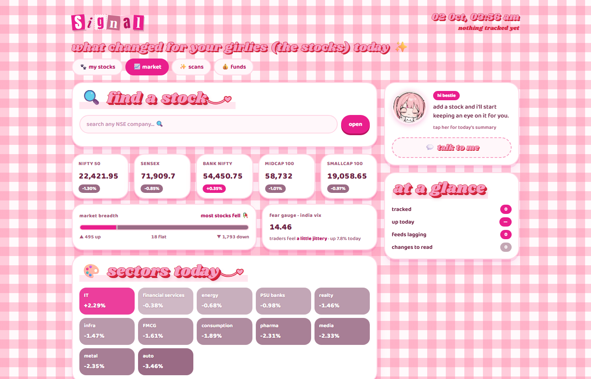
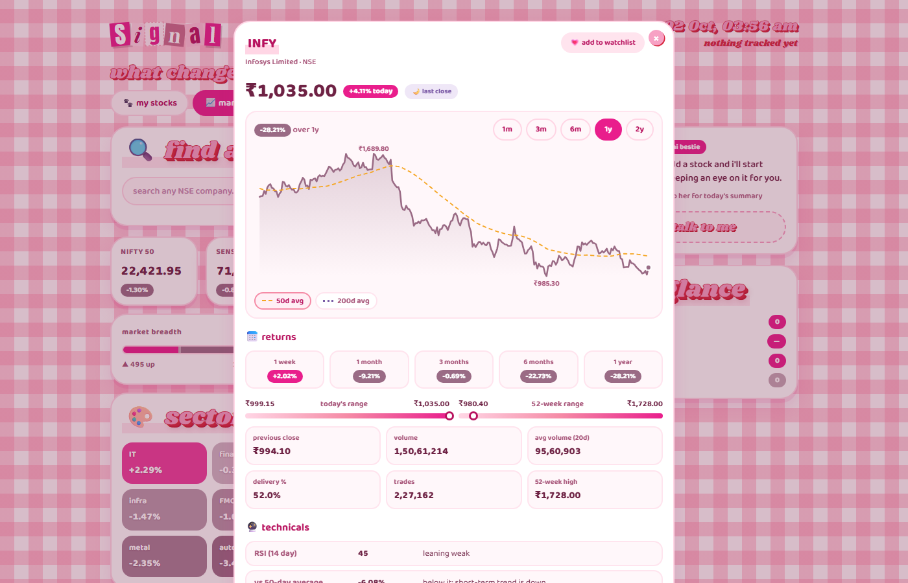

# Signal

**Groww CODE 2026 — Smart Market Watchlist**

A watchlist should tell you what changed *for the company*, not what changed on the screen. Signal strips out index-driven co-movement and alerts only on the unexplained residual — so on a day the whole market drops 2%, a stock that dropped 2% alongside it stays quiet, and the one that broke rank gets flagged.

Around that core it's a full, free market companion: market overview, readymade scans, stock and mutual-fund pages, and a mascot you can just talk to.

**Live:** https://signal-jagk.onrender.com (free tier — the first visit after a while can take 30–60s to wake up)



## 100-word pitch

Most watchlists tell you a stock moved. They can't tell you whether it mattered. Signal fits each stock's beta against NIFTY from daily closes, and alerts only on the residual — the move beta *can't* explain — scored against that stock's own historical residual volatility, not one fixed threshold for every name. Every alert carries a plain-English reason and the raw evidence behind it, never just a number. The ack watermark is monotonic per symbol, so a slow request from a second device can never rewind what you've already seen, and staleness is shown honestly — a 40-minute-old price never poses as live.

## Features

### 🐾 My stocks — the watchlist
- Search by company name or ticker ("infosys" finds INFY), live price, % change and a **staleness badge** on every quote: live, delayed, stale, market closed, or unknown.
- **"Since you last peeked"** shows `what_changed(t0, now)`: net changes to each stock's *state* (volatility regime, liquidity regime, beta to the index, position in its range) since you last acked it. It isn't a log of every tick. Moves that don't change anything lasting stay out.
- **Quiet log**: alerts that fired and then reverted before they changed anything, kept visible so nothing is hidden.

### 📈 Market — like Groww's Explore
- NIFTY 50, SENSEX, BANK NIFTY, MIDCAP 100, SMALLCAP 100.
- **Market breadth** (advances vs declines across every listed NSE company) and **India VIX** as a plain-words "fear gauge".
- **Sector heat tiles** for 12 NIFTY sector indices.
- **Top gainers, top losers, most active** across ~2,600 companies, with a liquidity floor (price ≥ ₹20, ≥ ₹1 Cr traded) so one tiny trade in a penny stock can't top the list.

### ✨ Scans — like StockEdge / Trendlyne
Volume shockers (3x+ their own 20-day median volume), high delivery (60%+ held, not day-traded), block trades, near their recent high, plus gainers, losers and most active. Companies only — ETFs are filtered out using NSE's own equity list.

### Stock pages
Hand-drawn SVG price chart (1m–2y, hover readout, optional 50/200-day averages), returns over 1w/1m/3m/6m/1y, today's and 52-week range bars, volume vs 20-day average, **delivery %** and trade count from NSE's bhavcopy, recent alerts, and **technicals in plain words**: RSI, price vs 50/200-day averages, golden/death-cross zone. These readings describe the chart; they never recommend.



### 💰 Funds
Search any Indian mutual fund and see its NAV chart (1 month to its whole history) and returns: absolute up to 1 year, CAGR for 3y/5y/since launch, the same convention AMFI factsheets use. A fund with no NAV for a week is flagged as possibly merged or closed.

### 🎀 Practice portfolio
Paper trading with ₹10,00,000 of pretend money: buy and sell any NSE stock at the latest price and track portfolio value, total and booked P&L, today's P&L, and a trade history. Guards against overspending and overselling. Nothing real is bought or sold, and the book is saved in your browser.

### The mascot chat
She's a rule-based helper (no AI model, no paid API) who reads the same data the page shows, so she can't contradict the screen:
- *"how's the market?"*, *"best sector today?"*, *"top losers"*, *"fear gauge"*
- *"tell me about TCS"*, *"compare TCS and INFY"*, *"volume shockers"*, *"parag parikh flexi cap fund"*
- *"what is RSI / NAV / CAGR / delivery %?"*, a plain-words glossary
- *"add TCS"*, *"remove TCS"*, *"open INFY"*: these actually do it
- Tickers she names are tappable, follow-up chips adapt to what you asked, and history is kept in your browser.
- She refuses buy/sell advice, every time.

## Data sources (all free, no API keys)

| What | Source |
|---|---|
| Live quotes, index/sector levels, daily history | Yahoo Finance chart endpoint |
| Delivery %, trade counts, block-trade detection, movers and scans | NSE delivery bhavcopy, ingested daily |
| Company names, equity vs ETF | NSE's `EQUITY_L.csv` and ETF list |
| Mutual fund NAVs | AMFI, via mfapi.in |

Not available for free, so not shown: fundamentals (P/E, results, shareholding), FII/DII flows, insider trades, tick-by-tick data, option chains.

## Architecture

- **Backend** — FastAPI + SQLAlchemy Core (plain SQL) on Supabase Postgres. Serves the built frontend from `frontend/dist`. Deployed on Render (Docker).
- **Frontend** — Vite + React, no UI or charting libraries; charts are hand-drawn SVG. Polls every 15s, no WebSockets.
- **Daily ingest** — a GitHub Actions cron (`.github/workflows/ingest-daily.yml`, 19:15 IST on weekdays) runs `backend/ingest_daily.py`: it refreshes the instrument list, fills **any** missing weekday in the last 30 days (so a failed day is retried, not left as a permanent gap), upserts the bhavcopy, and runs the end-of-day detectors. The daily DB touch also keeps the free Supabase project from auto-pausing.

| Endpoint | What it returns |
|---|---|
| `GET/POST/DELETE /api/watchlist` | the user's watchlist with quotes and staleness |
| `GET /api/changed` | `what_changed(t0, now)` statements per symbol |
| `GET /api/quiet-log` | alerts that fired and reverted |
| `POST /api/ack` | advance a symbol's seen-watermark (monotonic) |
| `GET /api/feed` | raw event feed by lens |
| `GET /api/market` | indices, sectors, breadth, movers |
| `GET /api/scans/{scan}` | a readymade scan |
| `GET /api/search?q=` | ticker / company-name search |
| `GET /api/stock/{symbol}` | stock page data (2y bars + NSE stats + alerts) |
| `GET /api/funds/search?q=`, `GET /api/funds/{code}` | fund search, NAV history and returns |
| `GET /api/quotes?symbols=` | latest quotes for up to 30 symbols (practice portfolio) |
| `GET /api/health/sources` | data-source health |

## Setup (clean clone, Postgres already provisioned)

```bash
git clone https://github.com/RitzRaven19/signal.git && cd signal
python -m venv .venv && source .venv/bin/activate   # Windows: .venv\Scripts\activate
pip install -r backend/requirements.txt
cp backend/.env.example backend/.env   # fill in DATABASE_URL
cd frontend && npm install && npm run build && cd ../backend
uvicorn app.main:app --reload
```

Open `http://127.0.0.1:8000`. `DATABASE_URL` is the only variable needed.

To run the daily ingest yourself: `pip install -r backend/requirements-ingest.txt` and `python backend/ingest_daily.py`. For the scheduled job, add `DATABASE_URL` as a repository secret on GitHub.

## The residual formula, and why it's the definition of "meaningful"

```python
rs = diff(log(stock_closes))          # daily stock log-returns
ri = diff(log(index_closes))          # daily NIFTY log-returns
beta = cov(rs, ri) / var(ri)
residual = stock_ret - beta * index_ret
z = residual / resid_sigma            # resid_sigma: trailing 20d stdev of residual
```

A stock's daily return is decomposed into the part beta says the index explains (`beta * index_ret`) and whatever is left over (`residual`). That leftover is specific to the company, not to the market — it's the part a beta-crash or a sector rally can't take credit for. Z-scoring the residual against *that stock's own* historical residual volatility, rather than a single fixed percentage move for every stock, is what makes the threshold meaningful: a 2% move is unremarkable for a stock whose residual normally swings 2%, and a 4σ event for one whose residual is usually near zero. An event only fires past `|z| >= 2.0`, and every event carries the full arithmetic behind it in `evidence`, not just the final number.

The bhavcopy detectors follow the same rule — judge each stock against its own history: **delivery conviction** fires on volume well above the stock's own norm with high delivery, and **block trades** compare today's average trade size with that stock's own 20-day median. (Comparing against the whole market's median flagged 282 of ~2,650 stocks on a normal day; per-stock, 68.)

## Watermark semantics

`ack.acked_at` only ever moves forward: `POST /api/ack` upserts with `set acked_at = GREATEST(ack.acked_at, excluded.acked_at)`. A slow request from a second device (an ack in flight from a phone, say, racing a newer ack from a laptop) can never rewind what the user has already marked seen — the greater of the two timestamps always wins, server-side. Verified directly: acking with a deliberately-older timestamp after a newer ack leaves `acked_at` unchanged.

## Edge cases handled (each with its one-line mitigation)

- **Yahoo blocks the default HTTP client with 429s** → browser `User-Agent` and up to 3 retries with backoff.
- **A live price can quietly go stale** → every quote carries a staleness tier computed from the source's own `as_of`, never the server clock, and it's always shown.
- **Overnight, every price looked "stale"** → a `closed` tier: when NSE is shut and the price is the last close, it's the correct price, not a lagging one.
- **Yahoo's daily bars can lag its live price by a day** → if the last bar predates the quote's own date, today's point is appended from the quote, so change-on-day uses the right previous close.
- **Yahoo pads holidays/halts with null rows** → dropped before they reach any calculation.
- **"Today" depends on server timezone** → day boundaries are computed explicitly in IST (the NSE trading day).
- **A detector re-scoring the same tick shouldn't double-alert** → unique `events.fingerprint`, `ON CONFLICT DO NOTHING`.
- **A day's bhavcopy download fails mid-run** → the ingest re-checks the last 30 weekdays for gaps every run, so the day is retried rather than skipped forever.
- **Per-row inserts made a day's ingest take ~4 minutes** → batched upserts via `jsonb_to_recordset`, one round trip per batch (~3s).
- **ETFs crowding the scans** → scans join NSE's equity list and keep companies only.
- **Penny stocks dominating gainers/losers** → liquidity floor of ₹20 price and ₹1 Cr traded.
- **Free-tier Supabase pauses after inactivity** → the daily ingest keeps it active.
- **New Supabase tables are world-readable via the anon key by default** → RLS on every table; the backend connects directly via `DATABASE_URL`.
- **A short history would crash the volatility calculation** → length checked before computing returns.

## Scope

Out of scope by design: auth beyond an anonymous cookie `user_id`, real-money portfolio tracking or broker integration (the practice portfolio is pretend money only), charting libraries, ML, a mobile app, WebSockets, real-time multi-user collaboration, and anything that needs paid data.

Still to do:
- **Accuracy report** — replay six months of bhavcopy offline and label alerts against the next day's tape. Not fabricating numbers for a backtest that hasn't been run.
- **Replay mode**, and **announcements / surveillance flags** from NSE.

## Accuracy report

Not yet populated, for the reason above — no placeholder numbers on principle.

| Detector | Alerts fired | Precision | Alerts / user / day |
|---|---|---|---|
| Naive (±2% price) | — | — | — |
| Residual (this build) | — | — | — |
